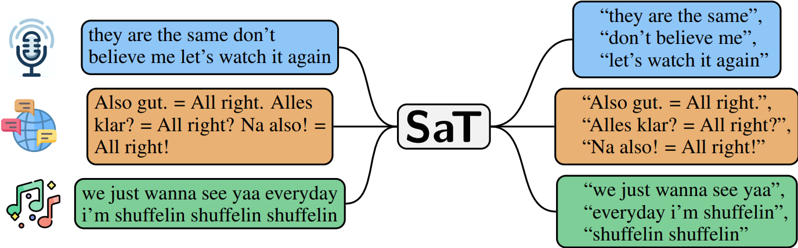

# Document Chunkers

Helpers to process raw documents

## Text

### Supported Models

- **SaT** &mdash; [Segment Any Text: A Universal Approach for Robust, Efficient and Adaptable Sentence Segmentation](https://arxiv.org/abs/2406.16678) by Markus Frohmann, Igor Sterner, Benjamin Minixhofer, Ivan Vulić and Markus Schedl (**state-of-the-art, encouraged**). - 85 languages
- **WtP** &mdash; [Where’s the Point? Self-Supervised Multilingual Punctuation-Agnostic Sentence Segmentation](https://aclanthology.org/2023.acl-long.398/) by Benjamin Minixhofer, Jonas Pfeiffer and Ivan Vulić. - 85 languages
- **PySBD** &mdash; [{P}y{SBD}: Pragmatic Sentence Boundary Disambiguation](https://arxiv.org/abs/2010.09657) by Nipun Sadvilkar and Mark Neumann  (rule-based, **lightweight**) - 22 languages
